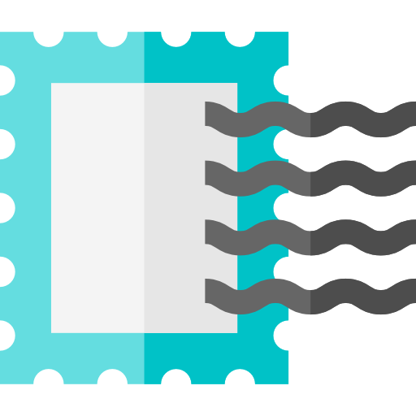

<!-- PROJECT LOGO -->
 

  
  <h1 align="center">TreLire</h1>

  

    Your local post office will envy this one.
  

<!-- TABLE OF CONTENTS -->
## Table of Contents

- [Table of Contents](#table-of-contents)
- [About The Project](#about-the-project)
  - [How it works](#how-it-works)
- [Getting Started](#getting-started)
  - [Updates](#updates)
- [Usage](#usage)
- [Contributing](#contributing)
- [License](#license)
- [Contact](#contact)

<!-- ABOUT THE PROJECT -->
## About The Project
![Product Name Screen Shot][screenshot]

**TreLire** is a wp_mail tester plugin. Want to be sure WordPress is able to send what it needs, when it needs it? You're a plugin away from that.

### How it works
TreLire adds a page to the WordPress' tools, and makes you able to send emails from there. You can personalize your email as you want, by adding
* Content Type
* Multiple recipients
* Sender
* Reply-to
* CC
* BCC
* Subject
* Attachments, using WP's media uploader.
* HTML body

<!-- GETTING STARTED -->
## Getting Started

You can just clone this repository inside your `wp-content/plugins` folder, or [download the installable zip](https://github.com/caffeinalab/trelire/zipball/master) and install it via the WordPress dashboard. 

### Updates
Right now, you have to manually update the plugin by checking this GitHub repo.

<!-- USAGE EXAMPLES -->
## Usage

To use TreLire, just install it to your WordPress website and click on the Tools menu. You can now send emails and test your WordPress website.
Need to use SMTP instead of your provider's mail? Check [Postino](https://github.com/caffeinalab/postino)!

<!-- CONTRIBUTING -->
## Contributing

Contributions are what make the open source community such an amazing place to be learn, inspire, and create. Any contributions you make are **greatly appreciated**.

1. Fork the Project
2. Create your Feature Branch (`git checkout -b feature/AmazingFeature`)
3. Commit your Changes (`git commit -m 'Add some AmazingFeature'`)
4. Push to the Branch (`git push origin feature/AmazingFeature`)
5. Open a Pull Request

<!-- LICENSE -->
## License

Distributed under the GPL License. See `LICENSE` for more information.

Icon made by <a href="https://www.flaticon.com/authors/freepik" title="Freepik">Freepik</a> from <a href="https://www.flaticon.com/"             title="Flaticon">www.flaticon.com</a>

<!-- CONTACT -->
## Contact

[Simone Montali](https://monta.li) - [@Caffeina](https://caffeina.com)

Project Link: [https://github.com/caffeinalab/trelire](https://github.com/caffeinalab/trelire)

[screenshot]: res/screenshot.gif "Screenshot"
[logo]: res/post-stamp.png
